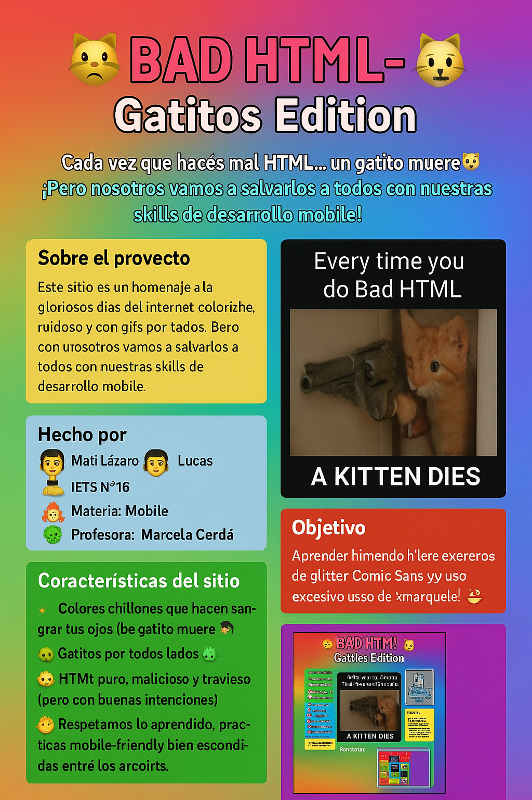

# 🐱 BAD HTML - Gatitos Edition 🐱

> **"Cada vez que hacés mal HTML... un gatito muere 😿"**  
> ¡Pero nosotros vamos a salvarlos a todos con nuestras skills de desarrollo mobile!

## 🧾 Sobre el proyecto

Este sitio es un homenaje a los gloriosos días del internet colorinche, ruidoso y con gifs por todos lados. Pero con una vuelta de tuerca: **es nuestra forma de aprender las mejores técnicas de desarrollo web móvil** (¡sí, leíste bien!).

Inspirados por sitios como "badhtml.com", tomamos esa estética **deliciosamente caótica** y la mezclamos con nuestro amor por los **gatitos**, para llevar nuestras prácticas de HTML al siguiente nivel.

---

## 👨‍💻 Hecho por

- 🧠 **Mati**
- 🧠 **Lázaro**
- 🧠 **Lucas**
- 🏫 IFTS N°16
- 📚 Materia: **Mobile**
- 👩‍🏫 Profesora: **Marcela Cérda**

---

## 🐾 Características del sitio

- Colores chillones que hacen sangrar tus ojos (¡pero de emoción!).
- Gatitos por todos lados 🐈🐈‍⬛.
- HTML puro, malicioso y travieso (pero con buenas intenciones).
- Respetamos lo aprendido: prácticas mobile-friendly bien escondidas entre los arcoíris.
- Gifs, íconos, y botones que probablemente no sirven para nada... ¿o sí?

---

## 📱 Objetivo

Aprender haciendo: dominar el **desarrollo web para mobile** mientras nos divertimos como si fuera el 2001 con conexión dial-up 🕹️  
Y de paso... **salvar a todos los gatitos del HTML mal hecho** 🐾

---

## 🚀 Cómo usar este proyecto

1. Cloná el repo:
   ```bash
   git clone https://github.com/usuario/bad-html-gatitos.git
   ```
2. Abrí el archivo `index.html` en tu navegador.
3. **Abrí bien los ojos** y disfrutá del espectáculo visual gatunesco.
4. No olvides inspeccionar el código y aprender (o no 😼).

---

## 💖 Agradecimientos

- A los gatitos de internet por su eterna paciencia con el HTML mal hecho.
- A GeoCities y MySpace por marcar nuestras infancias.
- A Marcela por bancarnos este proyecto loco.

---

## 📸 Captura de pantalla



---

## 📢 Disclaimer

Este sitio puede contener niveles extremos de glitter, Comic Sans y uso excesivo de `<marquee>`.  
**Ningún gatito fue lastimado durante el desarrollo.** 😽
